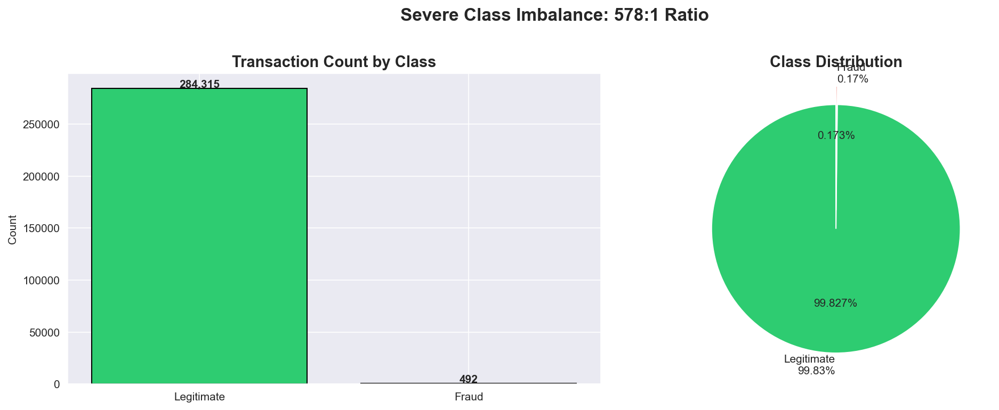
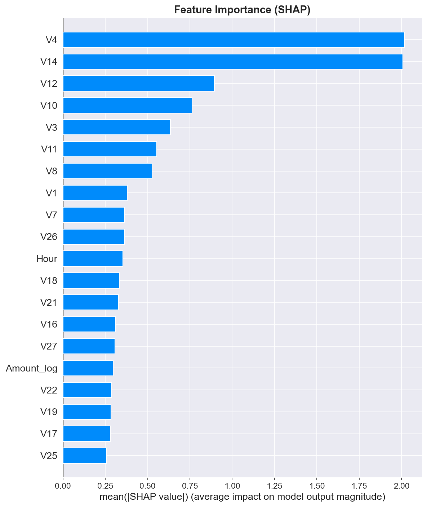

# Payment Fraud Detection System


## Overview
ML-powered fraud detection system analyzing **284,807 credit card transactions** with real-time risk scoring and explainable AI for regulatory compliance in financial services.

## Results
| Metric | Score |
|--------|-------|
| ROC-AUC | **0.9821** |
| Fraud Caught | **83.7%** |
| False Positive Rate | **0.026%** |
| True Negatives | **56,849** |
| Transactions Analyzed | **284,807** |

## Dashboard



## Features
- Real-time fraud risk scoring on any transaction sample
- SHAP explainability showing WHY each transaction was flagged
- Financial impact calculator (monthly savings estimator)
- Time-based fraud pattern analysis (2-4am = 10x higher fraud rate)
- Interactive risk score distribution visualization

## Key Findings
- **V4 and V14** are the strongest fraud indicators (SHAP importance ~2.0)
- Fraud rate **peaks at 2-4am** (1.71% vs average 0.17%)
- Fraud transactions average **€122 vs €88** for legitimate ones
- Class imbalance of **578:1** handled via scale_pos_weight

## Tech Stack
| Tool | Purpose |
|------|---------|
| XGBoost | Primary fraud detection model |
| SHAP | Model explainability for compliance |
| Streamlit | Interactive dashboard |
| Plotly | Data visualizations |
| scikit-learn | Data preprocessing & evaluation |
| pandas / numpy | Data manipulation |

## Project Structure
```
fraud-detection-system/
├── data/                   # Dataset (download from Kaggle)
├── models/                 # Saved visualizations
├── notebooks/
│   └── 01_exploration.ipynb  # Full EDA + model training
├── app.py                  # Streamlit dashboard
├── requirements.txt
└── README.md
```

## Installation & Usage
```bash
# Install dependencies
pip install -r requirements.txt

# Run dashboard
streamlit run app.py
```

## Dataset
Download `creditcard.csv` from [Kaggle Credit Card Fraud Detection](https://www.kaggle.com/datasets/mlg-ulb/creditcardfraud) and place in `data/` folder.

284,807 transactions | 492 fraud cases | 0.173% fraud rate

## Model Details
- **Algorithm:** XGBoost Classifier
- **Imbalance handling:** scale_pos_weight = 578 (578:1 ratio)
- **Features engineered:** Hour, Is_Night, Amount_log, Amount_Squared, Is_Round_Amount
- **Evaluation metric:** ROC-AUC (accuracy meaningless with 578:1 imbalance)

## Author
**SAIF ULLAH** | [GitHub](https://github.com/saif06910)